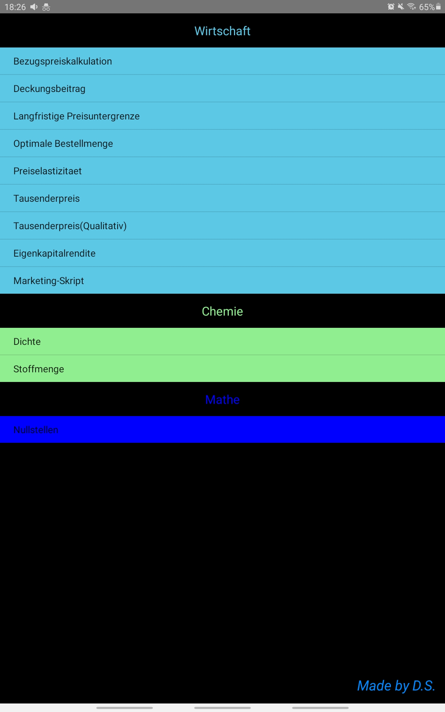

!!! Nicht kontrollierte App es können Fehler auftreten, bitte überprüfen Sie diese App genauestens vor der Nutzung.!!!

Ein Programmierübungsprojekt um mit der Programmiersprache Kotlin vertraut zu werden. Nicht optimiert und Anfängerfehler vorhanden, da es mein erstes Kotlin Projekt ist.

Startseite der App mit Übersicht aller Funktionen

Ausgewählte Funktion

